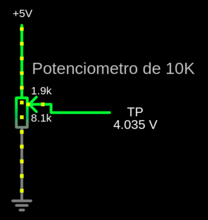

# TeR_PEDAL : Hardware Engineering Report
La placa PEDAL del vehiculo TeR, es la encargada de recopilar todos los inputs que el piloto introduce al coche, Acelerador (APPS), 
Freno Delantero (BPPS) y Volante (STEER). Los datos obtenidos serán utilizados por la ECU para gestionar el par comandado al powertrain.
## Requerimientos
La normativa de FSG tiene una sección (T11.8) que exije los siguientes requerimientos:

## Decisiones

### Sensores
  Por simplicidad y flexibilidad utilizaremos sensores analógicos para la medición de los pedales, steering y freno, cualquier [Potenciometro](https://es.wikipedia.org/wiki/Potenci%C3%B3metro)
  sirve, pero usamos concretamente los VariOhm de Eurosensors

|Fisicamente                                                                                                                 | Electricamente                         |
|----------------------------------------------------------------------------------------------------------------------------|----------------------------------------|
|      |     |

Para el Freno utilizamos un transductor de Presión-Voltaje que nos permite conocer mediante su función de transferencia la presión en la linea.

### MCU
  Se ha utilizado un stm32F103C8T6 de 48 pines por su facilidad de obtención, versatilidad, disponibilidad de un buen periferico [ADC SAR](https://en.wikipedia.org/wiki/Successive-approximation_ADC) y soporte CAN.
  su uso en la mayoría de placas de baja potencia de procesamiento permite estandarizar y familiarizar todos los diseños donde no se requiere mucha potencia de computo.
  
  | Specification               | Description                          |
  |-----------------------------|--------------------------------------|
  | Core                        | ARM Cortex-M3                        |
  | Operating Frequency         | 72 MHz                               |
  | Flash Memory                | 64 KB                                |
  | RAM                         | 20 KB                                |
  | GPIO                        | 37                                   |
  | Timers                      | 3 x 16-bit, 1 x 32-bit, 2 x watchdog |
  | Communication Interfaces    | 2 x I2C, 3 x USART, 2 x SPI, 1 x USB |
  | ADC                         | 2 x 12-bit, 10-channel               |
  | DAC                         | None                                 |
  | PWM Channels                | 15                                   |
  | Operating Voltage           | 2.0 - 3.6 V                          |
  | Package                     | LQFP48                               |
  | Temperature Range           | -40 to +85 °C                        |
  | Power Consumption (Sleep)   | 2 µA                                 |
  | Debug Interface             | SWD, JTAG                            |
  
  Estos micros se programan muy facilmente mediante el uso de un debugger ST-link y el stm32CUBE-IDE utilizando las librerías [HAL](https://es.wikipedia.org/wiki/Capa_de_abstracci%C3%B3n_de_hardware)

### Filtrado 
Para filtrar las señales recibidas por los sensores se utilizan unos filtros paso bajo RC , pasivos sencillos con frecuencia de corte ~100hz lo cual permite eliminar cualquier señal que 
no provenga del piloto (Sus inputs son mucho más lentos, Fourier...), convendría actualizar a filtros activos utilizando opamps para no afectar las impedancias de entrada.

## Comprobación de requisitos

